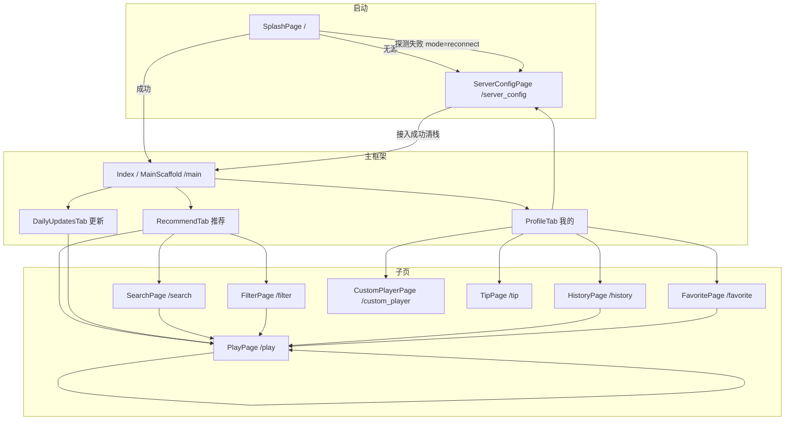
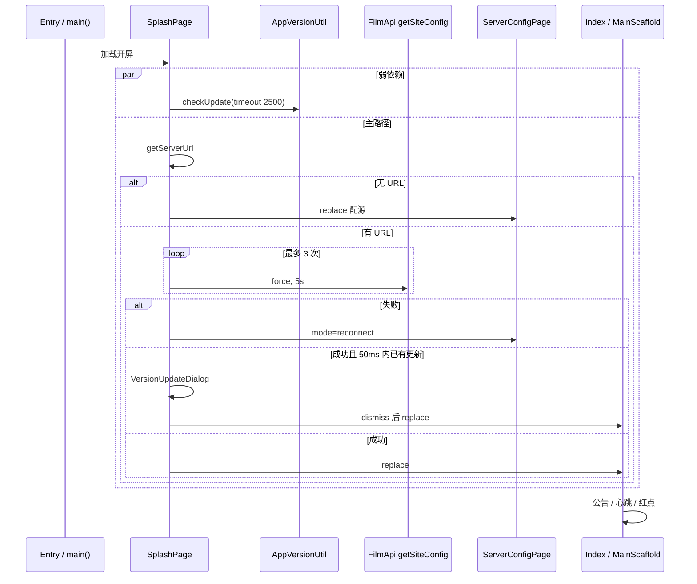
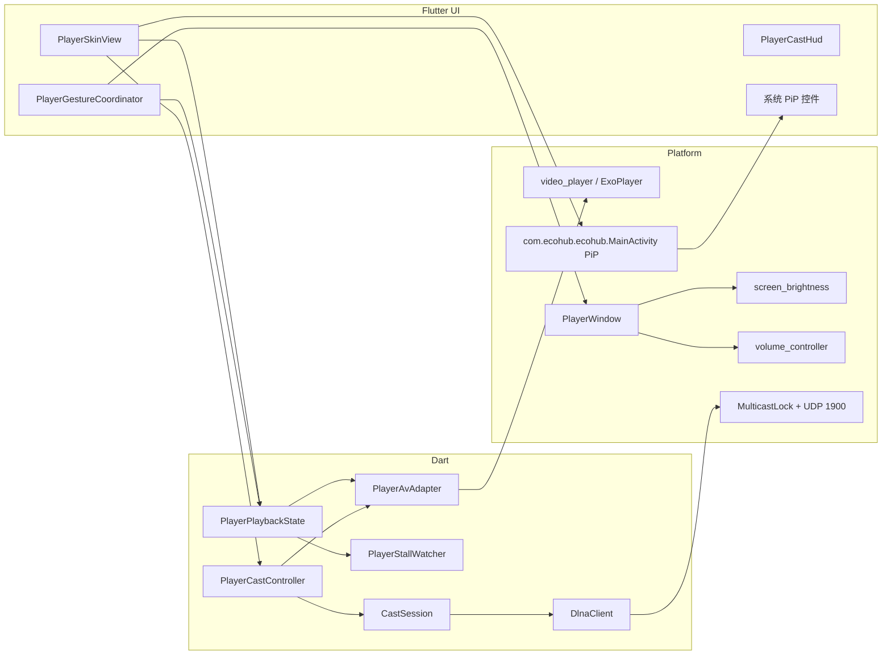
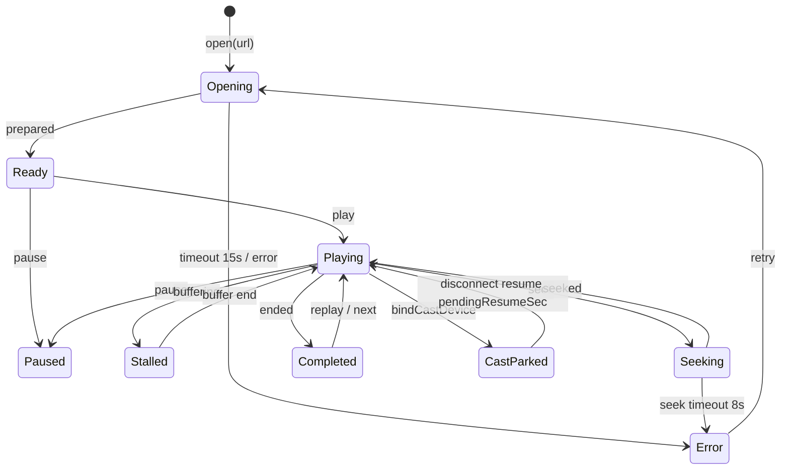
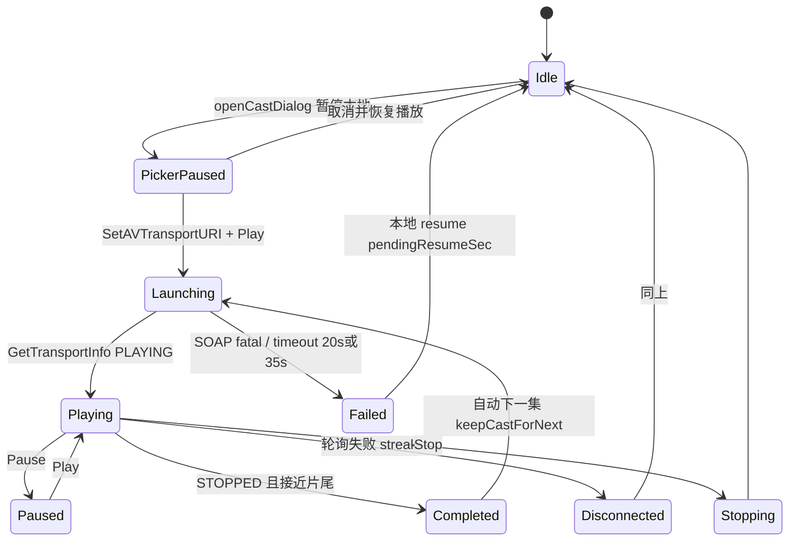

# EcoHub Android 客户端完全复刻鸿蒙端实现文档

| 字段 | 内容 |
|------|------|
| 文档标题 | EcoHub Android（Flutter）完全复刻 HarmonyOS 客户端实现规格 |
| 作者 | TBD |
| 日期 | 2026-09-09 |
| 状态 | Accepted |
| 复刻源（金标准） | `app-for-ohos/` |
| 复刻目标 | `app-for-android/`（Flutter，已有骨架） |
| 非复刻范围 | `server/` 服务端、`web/` 管理端 |

---

## Overview

EcoHub Android 客户端必须**完全复刻** HarmonyOS / OpenHarmony 客户端（`app-for-ohos`）的全部页面、交互与能力。Android 端已用 Flutter 搭出主链路（开屏 → 配源 → 三 Tab 首页 → 搜索 / 筛选 / 播放 / 历史 / 自定义播放 / 赞赏），但对照 OHOS 源码后，**收藏整条链路缺失、投屏整条链路缺失、PiP 缺失、播放器 HUD/手势/缩放 Chip 循环/倍速与系统亮度音量未对齐、源失效守卫在播放页会直接抢占、心跳未处理站点关闭与无网探测、开屏不弹版本更新、首页 Banner/分类胶囊/空态与鸿蒙不一致**。`IndexedStack` 现实现 if/else 恒为 3 子节点，**不是 Tab 错页**，不作为 P0。

本文以 OHOS 源码为金标准，逐页、逐模块对照 Android 现状，给出可落地的实现规格、接口签名、存储 key、状态机、依赖边界与按 PR 拆分的落地顺序。工程师应按「页面清单 → 功能清单 → 对应 PR」逐项合入，不以「更 Android」为由改交互。

### 功能 PR 进度（PR1–PR10）

| PR | 范围 | 状态 |
|----|------|------|
| PR1 收藏/历史 | 收藏闭环、站点卡双 chip、历史左滑/多列 | **已合** |
| PR2 源守卫/心跳/开屏更新 | SourceGuard、心跳停表、闪屏版本弹窗、reconnect PopScope | **已合** |
| PR3 parsePlay/详情弹层 | 字段回退、FilmDetailDialog、相关续播 | **已合** |
| PR4 首页/更新/搜索/筛选 | 胶囊、空态、FAB、gridCols、autofocus | **已合** |
| PR5 播放器核心 | HUD 3s、缩放 Chip、倍速、Stall、亮度音量 | **已合** |
| PR6 剪贴板/自定义播放 | ClipboardSniffer、粘贴、路由 `url` | **已合** |
| PR7a DLNA 发现+SOAP | SSDP/SOAP 单测 | 未开始 |
| PR7b 投屏 HUD | CastSession / 选择器 | 未开始 |
| PR8 PiP | `onUserLeaveHint` | 未开始 |
| PR9 宽屏分栏 | PlayPage `splitPlay`；配源横屏 **已提前合入 UI 对齐** | 部分 |
| PR10 打磨 | 全页走查 | 进行中（按页 UI 对齐） |

### UI 对齐进度（按页）

对照金标准：字号、间距、资源（startIcon）、空态、文案。不含投屏 / PiP / PlayPage 分栏。

| # | 页面 | UI 状态 | 本轮改动 |
|---|------|---------|----------|
| 1 | SplashPage 开屏 | **已对齐** | startIcon 84² r20；标题 22；状态行 18 / 间距 8 / 上距 24 |
| 2 | ServerConfigPage 配源 | **已对齐** | startIcon 56；标题/副标题字号；顶栏 48/36；横屏左 Logo 右表单；历史「当前」+ 清空确认 + 底注 |
| 3 | Index / MainScaffold | 待对齐 | — |
| 4 | RecommendTab 推荐 | **已对齐（FilmRow 通栏）** | FilmRow 通栏；竖向无弹性；`headerAlpha` 到顶清毛玻璃；下拉指示器 `edgeOffset = topInset+48`（顶栏下方） |
| 5 | DailyUpdatesTab 更新 | 待走查 | PR4 已补 FAB/栅格/空文案 |
| 6 | ProfileTab 我的 | **已对齐（顶栏）** | 去掉 `Center` 垂直居中；标题贴顶 `SPACE_SM/LG`；菜单 chevron 14；站点卡/菜单卡沿用 PR1 |
| 7 | SearchPage 搜索 | 待走查 | PR4 已补 autofocus / listLanes |
| 8 | FilterPage 筛选 | **已对齐** | `FilterBar` 放在 Column 顶部由行撑开；行键 = sortList ∪ tags（sortList 只有 Sort 时仍能出类型/剧情/地区）；粘性栏在下方列表 |
| 9 | PlayPage 播放 | 待走查 | 收藏/详情弹层已合；投屏/PiP/分栏另 PR |
| 10 | CustomPlayerPage | 待走查 | PR6 粘贴/空态/url |
| 11 | HistoryPage 历史 | 待走查 | PR1 左滑/多列 |
| 12 | FavoritePage 收藏 | 待走查 | PR1 新建 |
| 13 | TipPage 赞赏 | 待走查 | 文档原标小差异 |
| — | EmptyState / LoadingView | **已对齐** | 无圆底图标 40；加载圈 36 + `加载中...` + TEXT_SECONDARY |

---

## Background & Motivation

### 当前状态

- **OHOS**（`app-for-ohos/entry/src/main/ets/`）是功能完整的观影客户端：路由声明于 `resources/base/profile/main_pages.json`，Ability 入口 `entryability/EntryAbility.ets` 加载 `pages/SplashPage`，自研 AVPlayer 播放器（`modules/player/`，含 PiP / 倍速 / 缩放 / 手势 / 卡顿检测 / 防息屏），DLNA 投屏（`modules/cast/`），本地收藏 / 历史 / 搜索历史按软件源 host 隔离。
- **Android**（`app-for-android/lib/`）已镜像大部分页面文件名与 FilmApi 路径，使用 `video_player` + `shared_preferences` + `http`。`pubspec.yaml` 当前版本 `1.0.0+1`；OHOS `AppScope/app.json5` 为 `1.3.1`（versionCode 1003001）。Android **没有** `FavoritePage`、`FavoriteManager`、`ClipboardSniffer`、`modules/cast/**`、`PlayerPip`。
- 两端共用同一套服务端 HTTP API（`/api/index`、`/api/filmPlayInfo` 等），客户端差异只应出现在平台 API（PiP、亮度、组播、返回键）。

### 痛点

1. Android 用户无法收藏，Profile 也没有「我的收藏」入口。
2. 播放器缺少投屏、PiP、缩放、3x 长按、系统亮度/音量，全屏 HUD 与 OHOS `PlayerSkin` 不对齐。
3. `SourceGuard.intercept()` 在播放页会直接 `pushNamed('/server_config')`，打断观影；OHOS 会弹「继续观看 / 更换软件源」。
4. 站点 `state === false` 时，OHOS 心跳会清栈回 Index 维护页；Android 心跳只调 `SourceGuard.intercept()`，不会切维护视图。
5. 首页 Banner / 分类胶囊 / 空态「更换软件源」、每日更新回到顶部 FAB、配源页横屏分栏与双击退出，均未对齐。

---

## Goals & Non-Goals

### Goals

- 功能、页面、交互以 OHOS 为金标准 1:1 复刻（含收藏、投屏、PiP、剪贴板嗅探、公告/更新弹窗时序、源失效守卫、站点维护跳转）。
- 沿用现有 Flutter 结构：`lib/pages/`、`lib/components/`、`lib/utils/`（服务单例目前在 utils，新增 `FavoriteManager` 放 `lib/utils/favorite_manager.dart`，与 `history_manager.dart` 并列；不新开无关分层）。
- 本地存储 key / JSON 形状与 OHOS 对齐，且兼容 Android 已写入的 `film_history@{host}`、`search_history@{host}`、`server_base_url`。
- 平台差异给出等价实现：返回键 ↔ `onBackPress`，Android PiP API ↔ `PlayerPip`，Wi‑Fi 组播 + SOAP ↔ `DlnaClient`。

### Non-Goals

- 不改 `server/`、`web/`、OHOS 工程。
- 不把 Android 客户端改成原生 Kotlin 重写。
- 不引入状态管理框架（Riverpod / GetX / Bloc）或新的导航框架。
- 不实现 OHOS 物理上不存在于 Android 的窗口能力（ArkUI `WindowBar` 系统栏颜色精细控制）——宽屏 `splitPlay` 用 `MediaQuery` + `Row` + 播放器 `edgeHud`/insets 做**等价降级**（PR9，依赖 PR5 签名）。
- `FilmApi.getClassify('/filmClassify')` 两端均已封装但**无页面调用**；不单独做分类落地页，筛选仍走 `FilterPage` + `/filmClassifySearch`。
- 不移植 OHOS 死代码 `SOURCE_EPOCH`（只写不读）。
- 不实现 `PlayerScaleSheet`（OHOS 文件无引用；金标准是 HUD Chip `cycleScaleMode`）。
- 不把 Android `versionName` 升到 OHOS 的 `1.3.1`；营销版本线独立（见 Key Decisions）。
- 投屏不做媒体前台服务（FGS）；后台 poll 降级见 §8。
- 不重写已对齐模块：`getPlayInfo` 已 `timeoutMs: 20000`；FilterPage 已有 ScrollFab / pageSize=21 / `update_stamp`；HttpClient 网络失败不全局 intercept；搜索只补 `requestFocus`，不重做页面。

---

## 完整页面清单（OHOS → Android 映射表）

路由权威来源：OHOS `app-for-ohos/entry/src/main/resources/base/profile/main_pages.json`；Android `app-for-android/lib/main.dart` 的 `onGenerateRoute`。



### 1. 开屏 SplashPage

| 项 | OHOS | Android |
|----|------|---------|
| 中文名 | 开屏 | 开屏 |
| 路由 | `pages/SplashPage`（EntryAbility 默认） | `/` |
| 源文件 | `app-for-ohos/.../pages/SplashPage.ets` | `app-for-android/lib/pages/splash_page.dart` |
| 入口 | `EntryAbility.onWindowStageCreate` → `loadContent('pages/SplashPage')` | `MaterialApp.initialRoute = '/'` |
| 参数 | 无 | 无 |
| 完成度 | 金标准 | **已对齐（UI + 流水线）** |

**OHOS 行为（必须复刻）**

1. 最短展示 `MIN_SPLASH_TIME = 800ms`。
2. 并行启动 `AppVersionUtil.checkUpdate(false, 2500)`（弱依赖）。
3. `ServerConfigManager.getServerUrl()` 为空 → toast「请先配置软件源」→ `replaceUrl('pages/ServerConfigPage')`。
4. 否则最多 3 次 `FilmApi.getSiteConfig(true, 5000)`，文案「正在检测软件源连通性...」/「正在重试软件源连通性 (i/3)...」。
5. 失败 → toast「软件源连接失败...」→ `replaceUrl ServerConfigPage { mode: 'reconnect' }`。
6. 成功后 `Promise.race(updateCheck, 50ms)`：若已拿到 `hasUpdate` 则在闪屏上弹出 `VersionUpdateDialog`，关闭后再 `replaceUrl Index`；未就绪则进主页，由 Index 红点承接。
7. 公告**不在闪屏弹**，交给 Index。

**Android 现状 / 差异**

- 流水线已对齐：800ms、并行版本检查 2500ms、3 次探测、空源/失败跳配源、`mode: 'reconnect'`、50ms race 弹 `VersionUpdateDialog`。
- UI 已对齐：`StartIconImage` 84×84 r20；标题 22 / 上距 16；状态行圈 18、间距 8、上距 24。
- `main.dart` 已设透明状态栏，等价 `WindowBar` 的一部分。

### 2. 软件源配置 ServerConfigPage

| 项 | OHOS | Android |
|----|------|---------|
| 中文名 | 配置软件源 | 配置软件源 |
| 路由 | `pages/ServerConfigPage` | `/server_config` |
| 源文件 | `pages/ServerConfigPage.ets` | `pages/server_config_page.dart` |
| 入口 | 闪屏 / 我的卡片 / 源失效守卫 / 首页空态「更换软件源」 | 同，但首页空态无此按钮 |
| 参数 | `mode`: `'reconnect'` 或缺省 | `args['mode']` |
| 完成度 | 金标准 | **已对齐（UI；横屏分栏已合）** |

**主要 UI / 交互（OHOS）**

- 非 reconnect：左上 `BackIcon` 可返回。reconnect：**无返回**，`onBackPress` 2s 内再按退出 `terminateSelf()`，否则 toast「再按一次退出应用」。
- 输入框 + 清空；有历史时胶囊「历史记录 (N)」打开居中模态（清空 / 单条删除 / 「当前」标记）。
- `HttpClient.testConnection(url)` → `GET {origin}/api/health`，`code === 0` 才保存。
- 成功：`setServerUrl`、`FilmApi.clearSiteConfig`、`SiteHeartbeat.resetFailures`、`SourceGuard.markClosed` + `notifyReconnected`、toast「已重新接入」/「源已接入」、**`router.clear()` + `replaceUrl Index`**。OHOS 另写 `AppStorage SOURCE_EPOCH`，全仓库**无读取**，属死代码，Android **不移植**。
- 横屏：左 Logo 右表单（`windowWidth > windowHeight`）。
- 键盘 `KeyboardAvoidMode.RESIZE`。
- reconnect：`onBackPress` 消费返回；历史 Dialog 打开时 back 只关 Dialog；2s 内再按 `terminateSelf()`。

**Android 现状 / 差异**

- 流程已对齐：reconnect `PopScope` + 双击退出；成功 `pushNamedAndRemoveUntil('/main')`；`onChanged` setState 清空图标。
- UI 已对齐：startIcon 56；竖屏标题 24 / 副标题 13；横屏左 Logo 右表单（提前自 PR9）；历史弹窗「当前」标记、清空确认、「点击任意软件源即可直接选择填入」。
- 系统返回在历史 Dialog 打开时由 Flutter `showDialog` 先关 Dialog。

### 3. 主框架 Index / MainScaffoldPage

| 项 | OHOS | Android |
|----|------|---------|
| 中文名 | 首页框架 | 首页框架 |
| 路由 | `pages/Index` | `/main` |
| 源文件 | `pages/Index.ets` | `pages/main_scaffold_page.dart` |
| 入口 | 闪屏 / 配源成功 | 同 |
| 参数 | 无 | 无 |
| Tab | 推荐 / 更新 / 我的 | 同 |
| 完成度 | 金标准 | **部分对齐** |

**OHOS 行为**

- 懒加载 `tabReady[]`，未点过的 Tab 不构建。
- `FilmApi.onConfigChange` + `loadSite`；`state === false` 显示维护页（刷新重试 / 更换软件源）。
- 公告：`noticeEnabled && noticeShowInApp !== false && noticeContent`，且 `AppVersionUtil.isVersionMatched`，且本会话未关过（`NOTICE_DISMISSED_SESSION`）。**另：`config.state === false` 不弹公告。**
- 版本更新弹窗由 `@StorageLink SHOW_APP_UPDATE_DIALOG` 驱动；「我的」Tab 红点 `HAS_APP_UPDATE`。
- `HttpClient.trackView('browse', '', 'IndexPage')`。
- `SiteHeartbeat.start()`；`onPageShow` 再 start；`SourceGuard.onReconnect`。
- 底栏高度 `AppTheme.TAB_HEIGHT = 56`，背景 `BG_ELEVATED`。

**Android 差异**

- 维护页、公告、底栏红点、心跳 start/stop（`WidgetsBindingObserver`）已有。
- **缺**：`config.state === false` 时抑制公告；会话级 `NOTICE_DISMISSED_SESSION`（进程内 `_hasDismissedNotice` 近似，热重载会丢）；Index 浏览埋点（`EcoHubRouteObserver` 对 `/main` 会报 `MainScaffold`，应对齐为 `IndexPage`）。
- **IndexedStack 并未错页**：现代码是 `if (_tabReady[i]) Tab else SizedBox.shrink()`，恒为 3 个 children；`_selectTab` 同一次 `setState` 置 `_tabReady[index]=true` 且 `_currentTabIndex=index`。与 OHOS `tabReady[]` + `Visibility` 同类懒加载。P2 可选改为 `Offstage`+`TickerMode`，避免未点过的推荐 Tab 在后台跑 Banner 计时器；**不进 P0、不进 PR1**。
- Android 未把版本弹窗挂在主框架（只在 ProfileTab 本地 `_showUpdateDialog`），与 OHOS StorageLink 全局弹窗不一致：从「我的」切走弹窗会随 Tab dispose 消失。

### 4. 推荐 Tab RecommendTab

| 项 | OHOS | Android |
|----|------|---------|
| 中文名 | 推荐 | 推荐 |
| 路由 | Index 内嵌，无独立路由 | 同 |
| 源文件 | `pages/RecommendTab.ets` + `components/film/HomeBanner.ets` | `pages/recommend_tab.dart` + `home_banner.dart` + `film_row.dart` |
| 入口 | Index Tab 0 | 同 |
| 完成度 | 金标准 | **已对齐（FilmRow 通栏；Banner/胶囊已合）** |

**OHOS UI 区块**

- 沉浸顶栏：站点名 + 搜索胶囊；滚动 `headerAlpha` 0→1（宽屏保底 0.76）。
- `HomeBanner`：宽屏 peek 卡片、竖屏全幅、自动轮播、点「立即播放」`NavUtil.openPlay(mid || id)`。
- 分类胶囊：每个 `visibleSections()`（`nav.show !== false`）首字用 **CalligraphyFont** + 描边圆；点击 `NavUtil.openFilter(nav.id)`。
- 分类横滑 `FilmRow`，更多进筛选。
- 自定义下拉（阻尼 0.42，阈值 46）+ `RefreshHint.succeed()`。
- 空数据：EmptyState +「刷新」+「更换软件源」。
- `SourceGuard.onReconnect` 重拉 `/index`。

**Android 差异**

- Banner / 分类胶囊 / 空态「更换软件源」/ headerAlpha / 下拉「已更新」已合。
- **本轮**：`FilmRow` 通栏；竖向无弹性；`headerAlpha` 到顶清毛玻璃；下拉圈 `edgeOffset = 顶栏高度`，出现在标题栏下方（此前叠在状态栏/顶栏后）。
- 指示器形态仍用 `RefreshIndicator`（非 OHOS 38² 浮动圈），属平台差异。

### 5. 每日更新 DailyUpdatesTab + DailyUpdatePane

| 项 | OHOS | Android |
|----|------|---------|
| 中文名 | 每日更新 | 每日更新 |
| 源文件 | `pages/DailyUpdatesTab.ets`、`DailyUpdatePane.ets` | `pages/daily_updates_tab.dart`、`daily_update_pane.dart` |
| API | `GET /dailyUpdates?pid&current&pageSize=21` | 同 |
| 完成度 | 金标准 | **部分对齐** |

**OHOS**

- 先拉 `pid=0` 作为 seed；分类 chips + Swiper；相邻页 `active` 才加载。
- Pane：seed 命中不重复请求；分页；自定义下拉；`ScrollFab` 在滚过一屏后出现。
- 网格列数 `Breakpoint.gridCols`（手机 3 / md 4 / lg 6 / xl 8）。
- 空文案「近 24 小时还没有新片入库」。

**Android 差异**

- TabBar + TabBarView + seed + 分页 + RefreshIndicator 已有。
- **缺**：`ScrollFab`；网格固定 `crossAxisCount: 3`，平板不加密；空文案「今日暂无更新内容」；错误态外层无下拉（仅按钮重试）。

### 6. 我的 ProfileTab

| 项 | OHOS | Android |
|----|------|---------|
| 中文名 | 我的 | 我的 |
| 源文件 | `pages/ProfileTab.ets` | `pages/profile_tab.dart` |
| 完成度 | 金标准 | **已对齐（顶栏 + 站点卡）** |

**OHOS 区块**

1. 标题「我的」。
2. 站点卡：logo（失败回退 startIcon）+ 站名 +「软件源 {host}」胶囊，点击进配源。
3. **同一卡片内两枚 action chip：我的收藏 / 观看历史。**
4. 菜单卡：自定义播放；若 `tipEnabled` 则赞赏；版本检查（NEW 徽章 + `发现新版本 vX`）。

**Android 差异**

- 站点卡双 chip、startIcon 回退、菜单卡已合。
- **本轮**：去掉 `Center`，内容顶对齐（截图中「我的」悬在屏幕中部即此 bug）；标题 padding 对齐 `SPACE_SM`/`SPACE_LG`。
- 版本弹窗仍由主框架 `SHOW_APP_UPDATE_DIALOG` 挂载（PR2），不在本 Tab 本地。

**Profile 站点卡布局（PR1 必须按 `ProfileTab.ets` 抄，禁止只在菜单列表加一项）**

1. 外层站点卡 `BG_ELEVATED` + 圆角：上行 Logo | 站名 +「软件源 {host}」胶囊 | chevron；整卡点击进配源。
2. Divider。
3. **同一张卡内** `Row` 两枚 `sourceActionChip`，`layoutWeight: 1`，左「我的收藏」右「观看历史」，高度 44。
4. 下方独立菜单卡：自定义播放 / 赞赏（`tipEnabled`）/ 版本检查。观看历史从菜单列表**移入**站点卡，菜单里不再重复。

### 7. 搜索 SearchPage

| 项 | OHOS | Android |
|----|------|---------|
| 中文名 | 搜索 | 搜索 |
| 路由 | `pages/SearchPage` | `/search` |
| 参数 | `keyword?` | `args['keyword']` |
| 源文件 | `pages/SearchPage.ets` + `SearchSuggestPane.ets` + `SearchResultItem.ets` | `pages/search_page.dart` + `search_result_item.dart` |
| 完成度 | 金标准 | **部分对齐** |

**OHOS**

- 建议页：搜索历史（单条 x、清空确认）+ 热词（`/hotKeywords?limit=8`，失败用内置 8 词）。
- placeholder：`大家都在搜：{hot[0]}`。
- 提交：`trackView('search', kw, 'SearchPage')`、`SearchHistoryManager.add`、分页。
- 结果：`Breakpoint.listLanes` 多列 + `SearchResultItem`。
- 进入无 keyword 时自动 focus。

**Android**：历史 / 热词 / 分页 / placeholder / `FocusNode` 已有。**只缺**：无 `keyword` 进入时 `requestFocus`；结果 `listLanes` 多列；`trackView` 的 page 传 `SearchPage`。禁止重做搜索页、禁止为抽 `SearchSuggestPane` 而重构已内联的建议区。

### 8. 分类筛选 FilterPage

| 项 | OHOS | Android |
|----|------|---------|
| 中文名 | 片库筛选 | 片库筛选 |
| 路由 | `pages/FilterPage` | `/filter` |
| 参数 | `Pid`, `Category?`, `Sort?` | `Pid`/`pid`, `Category`, `Sort` |
| 源文件 | `pages/FilterPage.ets` | `pages/filter_page.dart` |
| API | `GET /filmClassifySearch` | 同 |
| 完成度 | 金标准 | **已对齐（本轮 UI）** |

布局参考 EcoTV `lib/views/filter`：`DynamicSliverAppBar`（筛选行上滑收起）+ `StickyAppbar`（粘性顶栏）。视觉与逻辑对齐 OHOS：

- 无「片库」标题 AppBar；粘性栏 = 返回 32² + 描边胶囊（透明底、ACCENT 边、12/28）+ `共 N 部`
- `FilterTagRow`：行高 44、标题宽 40 / 字号 13 / `TEXT_SECONDARY`；芯片高 32、字号 13、间距 8；选中 `ACCENT`+`TEXT_PRIMARY`，未选 `BG_CARD`+`TEXT_SECONDARY`；选中项滚到行首
- 竖向 `Clamping` 无弹性；FAB 阈值 `viewportDimension`（对齐 OHOS `y > listHeight`）
- Sort 默认 `update_stamp`；`fetchLock` 防重入；下拉不闪列表；`trackView(..., 'FilterPage')`
- 空态「没有符合条件的影片」无副标题；失败 `EmptyState` 无重试按钮；底栏「加载中...」/「没有更多了」高 40
- 网格 `Breakpoint.gridCols`，行距 `SPACE_MD`、列距 `SPACE_SM`

平台差异：Material `RefreshIndicator` 圈，非 OHOS 38² `RefreshHint` 浮标。

### 9. 播放详情 PlayPage

| 项 | OHOS | Android |
|----|------|---------|
| 中文名 | 播放 | 播放 |
| 路由 | `pages/PlayPage` | `/play` |
| 参数 | `id`, `sourceId?`, `episodeIndex?`, `currentTime?` | 同（`main.dart` 解析） |
| 源文件 | `pages/PlayPage.ets` | `pages/play_page.dart` |
| 完成度 | 金标准 | **部分对齐（缺收藏/投屏/PiP/分栏）** |

**入口**：FilmCard / Banner / 搜索结果 / 历史 / 收藏 / 相关推荐。

**OHOS 行为必须保留**

- 无路由续播参数时 `HistoryManager.find(id)`：补 sourceId / episodeIndex；若 `currentTime >= duration - 3` 则从头。
- `FilmApi.getPlayInfo(id, playFrom, episode)`；`getRelate(id)`。
- 播放器 `VideoPlayer`：全屏、上/下集、结束自动下集、进度 3s 节流写入历史。
- 详情 `PlayDetailPanel` + `FilmDetailHeader`（**收藏按钮**、评分、点简介打开 `FilmDetailDialog`）。
- 相关推荐 Tab；点相关会 `trackView play` 并按该片历史续播。
- 宽屏且非全屏：`splitPlay()` 左右分栏（播放器 | 详情）。
- 返回：全屏先退出全屏。
- `SourceGuard` 在此页弹确认框而非直接跳配源。

**Android 差异**

- 续播 / 换源换集 / 相关 / 历史持久化 / 全屏返回 已有。
- **缺**：收藏；`FilmDetailDialog`（Android header 只做展开收起）；相关推荐不读历史续播、不埋点；宽屏分栏（PR9，依赖 PR5 的 `edgeHud`/insets）；竖屏全屏（OHOS `isPortrait` 竖视频全屏不转横，PR5）；投屏/PiP；缩放 Chip（循环 FIT/COVER/STRETCH，不是 Sheet）。
- `PlayDetailPanel` 未传 `filmId`/`picture`，PR1 必须改构造并透传到 `FilmDetailHeader`。

### 10. 自定义播放 CustomPlayerPage

| 项 | OHOS | Android |
|----|------|---------|
| 中文名 | 自定义播放 | 自定义播放 |
| 路由 | `pages/CustomPlayerPage` | `/custom_player` |
| 参数 | `url?` | **未读取**（`const CustomPlayerPage()`） |
| 源文件 | `pages/CustomPlayerPage.ets` | `pages/custom_player_page.dart` |
| 完成度 | 金标准 | **部分对齐** |

OHOS：URL 栏 + **PasteButton 调 `ClipboardSniffer.sniff()`** 提取 http(s) 直链并播放；校验 mp4/m3u8；不写历史；同一套 `VideoPlayer`。Android 无粘贴/嗅探，无路由 `url`。

### 11. 观看历史 HistoryPage

| 项 | OHOS | Android |
|----|------|---------|
| 中文名 | 观看历史 | 观看历史 |
| 路由 | `pages/HistoryPage` | `/history` |
| 源文件 | `pages/HistoryPage.ets` | `pages/history_page.dart` |
| 完成度 | 金标准 | **部分对齐** |

两端：列表、清空确认、进播放带续播参数、按源隔离。OHOS：左滑删除、`listLanes` 多列、`trackView browse HistoryPage`、下拉 `RefreshHint`。Android：对话框删除、单列。`EcoHubRouteObserver` 已报 `HistoryPage`。

**PR1 必须一并做历史交互**（与收藏同一套 `Dismissible` + `Breakpoint.listLanes`）：左滑删除替代确认对话框（或滑动露出删除，与 FavoritePage 一致）；多列。`HistoryManager.migrateLegacy()` 也在 PR1，避免 http/https 别名丢记录拖到打磨阶段。`maxWidth: 1280` 与配源横屏仍归 PR9。

### 12. 我的收藏 FavoritePage — **Android 未实现**

| 项 | OHOS | Android |
|----|------|---------|
| 中文名 | 我的收藏 | 我的收藏 |
| 路由 | `pages/FavoritePage` | **未实现**（目标 `/favorite`） |
| 源文件 | `pages/FavoritePage.ets` | **未实现** |
| 入口 | Profile 站点卡 chip；`NavUtil.openFavorite` | 无 |
| 完成度 | 金标准 | **缺失** |

**必须复刻的 UI / 交互**

- `PageHeader` 标题「我的收藏」，右侧「清空」（危险色），确认「确定清空当前软件源的所有收藏记录吗？」
- 空态：「暂无收藏」/「在播放页点击收藏后会显示在这里」
- 列表项：80×116 封面、标题、`cName · year · area`（否则 subTitle /「未知」）、remarks、`收藏于 {FormatUtil.dateTime(createdAt)}`
- 点击 `NavUtil.openPlay(item.id)`（不带 source/episode，走播放页自己的历史续播）
- 左滑删除 → `FavoriteManager.remove` toast「已取消收藏」
- `FavoriteManager.onFavoriteChange` + `SourceGuard.onReconnect` + `onPageShow` 刷新
- `trackView('browse', '', 'FavoritePage')`
- 宽屏 `listLanes`

### 13. 赞赏 TipPage

| 项 | OHOS | Android |
|----|------|---------|
| 中文名 | 赞赏支持 | 赞赏支持 |
| 路由 | `pages/TipPage` | `/tip` |
| 源文件 | `pages/TipPage.ets` | `pages/tip_page.dart` |
| 完成度 | 金标准 | **已对齐（小差异）** |

两端：`getSiteConfig`、渠道二维码、无渠道空态。OHOS 有独立 `TipQrImage` 加载态。Profile 仅 `tipEnabled` 时显示入口。

### 弹窗（非独立路由）

| 弹窗 | OHOS | Android | 完成度 |
|------|------|---------|--------|
| 站点公告 `NoticeDialog` | `components/dialogs/NoticeDialog.ets`，Index 挂载 | `components/notice_dialog.dart`，MainScaffold 挂载 | 部分对齐（缺 state=false 抑制、横屏高度） |
| 版本更新 `VersionUpdateDialog` | 闪屏 + Index StorageLink | 仅 ProfileTab | 部分对齐 |
| 影视详情 `FilmDetailDialog` | Header 点简介底部弹层 | **缺失**（Header 内联展开） | 缺失 |
| 投屏选择 `PlayerCastSheet` | `modules/cast/PlayerCastSheet.ets` | **缺失** | 缺失 |
| 倍速 `PlayerSpeedSheet` | 0.75–3.0x 标签 | `player_speed_sheet.dart` 0.5–2.0x | 部分对齐（档位与真 3.0x 见 Key Decisions） |
| 缩放 | HUD Chip 点击 `cycleScaleMode()` 循环 FIT→COVER→STRETCH，`showTip('画面：${scaleLabel}')`。`PlayerScaleSheet.ets` **无任何引用，死代码，不复刻** | 无 Chip、无循环 | 缺失 Chip，**不要做 Sheet** |
| 源失效确认 | `SourceGuard` 播放页 Alert | **缺失**（直接跳配源） | 缺失 |

---

## 完整功能清单（按模块）

### 1. 启动 / 闪屏 / 软件源 / health / 心跳

| 能力 | OHOS 位置 | Android 现状 | 缺口 | 建议实现 |
|------|-----------|--------------|------|----------|
| 开屏最短 800ms + 3×5s 探活 | `SplashPage.ets` `PROBE_*` | `splash_page.dart` 已有 | 闪屏版本弹窗；`checkUpdate` 2500ms + in-flight 去重 | 并行 `AppVersionUtil.checkUpdate(force: false, timeoutMs: 2500)`，50ms race，有更新则叠 `VersionUpdateDialog` |
| 配源 + 历史 10 条 | `ServerConfigManager` `KEY_SERVER_HISTORY` | 已有 | 横屏分栏（PR9）、reconnect `PopScope`、清栈 | 成功一律 `pushNamedAndRemoveUntil('/main', (r) => false)`；reconnect `canPop:false` |
| health | `HttpClient.testConnection` → `GET {origin}/api/health` | 已有，`SourceGuard.beginSkip` | 无 | **保持**；`_send` 失败不要全局 intercept |
| 心跳 10s / 连续 3 次失败 | `SiteHeartbeat.ets` | `site_heartbeat.dart` 有间隔与 3 次 | 见下方规格 | PR2 按规格实现 |
| 站点维护视图 | `Index.ets` | `main_scaffold_page.dart` `_buildMaintenanceView` | 停在 `/play` 时心跳不主动清栈 | `checkSiteClosedState` 读 `EcoHubRouteObserver.currentName` |

启动 / 源校验流程：



#### 心跳 / SourceGuard 可落地规格（PR2）

**当前路由**：`EcoHubRouteObserver` 增加静态 `String? currentName`，在 `didPush` / `didReplace` / `didPop` / `didRemove` 更新为栈顶 `settings.name`。心跳与 `SourceGuard` **禁止**依赖 `ModalRoute.of`（无 BuildContext）。

**路由常量表**（与 OHOS `path/name.indexOf(...)` 等价）：

| 角色 | Android name |
|------|----------------|
| 播放页 | `/play` |
| 配源页 | `/server_config` |
| 闪屏 | `/` |
| 主框架 | `/main` |

**`SourceGuard.intercept({VoidCallback? onContinue})`**：

1. `skipCount>0` 或 `intercepting` 或无 cached URL → return。
2. `currentName == '/server_config'` → return。
3. `currentName == '/play'`：Alert 标题「软件源失联」、正文「检测到当前软件源连接异常，是否前往重新配置？」；主按钮「更换软件源」走配源；次按钮「继续观看」与 cancel 调 `onContinue` 并清 `intercepting`。
4. 其他页：`pushNamed('/server_config', arguments: {mode: 'reconnect'})`。

**心跳**：

- `start()`：**每次**把 `consecutiveFailures=0` 并保证调度（去掉 Android `if (_running) return` 导致不重置的行为）。Index 回到前台依赖此点。
- 构造或 `start` 时 `FilmApi.onConfigChange → checkSiteClosedState`。
- 探活：`getSiteConfig(force: true, timeoutMs: 8000)`。
- 配源页 / 闪屏：跳过探活，仍 `scheduleNext(10000)`。
- **无网不计失败**：`connectivity_plus` 读 `ConnectivityResult.none` 则 `consecutiveFailures=0` 并继续调度。**禁止**把 `SocketException` / HTTP 失败当无网。Portal 热点**不做**（OHOS 排 PORTAL，Android 无等价 API，明确降级）。
- 连续 3 次失败：调用 `intercept(onContinue: ...)` 后 **停止 scheduling**；仅「继续观看」里 `resetFailures` + `scheduleNext(60000)`。不要在 `finally` 里继续 10s 探活。
- `checkSiteClosedState`：`state===false` 且当前不是 `/server_config`、`/`、`/main` → `pushNamedAndRemoveUntil('/main', (r) => false)`。

### 2. 首页推荐

见页面清单 §4。额外：`RecommendTab` 分类点击参数必须是 `Pid: '${nav.id}'`（Android 已做）。OHOS 无「片库分类」小标题，胶囊直接横滑；Android 多了「片库分类」标题，**应去掉以对齐金标准**。

### 3. 每日更新

见页面清单 §5。`pid` 为分类 id，`0` 表示全部。分页 `pageSize=21`。Android 补 `ScrollFab`（已有 `components/scroll_fab.dart`）与响应式列数。

### 4. 搜索 / 剪贴板嗅探

搜索见 §7。剪贴板：

| 能力 | OHOS | Android | 建议 |
|------|------|---------|------|
| `ClipboardSniffer.extractVideoUrl` / `sniff` / `markHandled` | `common/utils/ClipboardSniffer.ets` | **缺失** | `lib/utils/clipboard_sniffer.dart`，用 `Clipboard.getData(Clipboard.kTextPlain)`，**不新依赖** |
| 自定义播放粘贴按钮 | `PasteButton` | 缺失 | 普通 `TextButton`「粘贴」（Android 无 OHOS 隐私 PasteButton，等价为一次读取剪贴板） |

### 5. 分类筛选

见 §8。`QueryParams`：`Pid, current, pageSize, Category, Sort, ...tagKeys`。Android `Map<String,dynamic>` 已等价。

### 6. 播放详情（简介 / 源 / 剧集 / 收藏 / 续播 / 投屏入口）

| 能力 | OHOS | Android | 缺口 |
|------|------|---------|------|
| 简介 + 评分 | `FilmDetailHeader.ets` | `film_detail_header.dart` | 无收藏；无 `FilmDetailDialog` |
| 播放源 / 100 集分组 | `PlayDetailPanel.ets` `GROUP_SIZE=100` | 已有 | 宽屏 2 列 vs 3 列逻辑已有 `_usesWideTiles` |
| 收藏 toggle | `FavoriteManager.toggleFavorite` | **缺失** | 见数据模型 |
| 续播 | `PlayPage.persistHistory` + `MIN_RESUME 2s` | 已有，进度未 3s 节流（`video_player_widget` 每次 listener 都回调） | 应对齐 `PlayerPlaybackState.PROGRESS_PERSIST_INTERVAL_MS = 3000` |
| 投屏入口 | `PlayerSkin.castEntry` `canCast` | 缺失 | 见播放器规格 |

### 7. 自定义播放器能力矩阵

OHOS 入口组件 `modules/player/VideoPlayer.ets`，Android `components/player/video_player_widget.dart`。

| 能力 | OHOS 实现 | Android 现状 | 缺口与建议 |
|------|-----------|--------------|------------|
| 引擎 | `PlayerAv` → `media.AVPlayer`，HLS/mp4 | `video_player`（Android ExoPlayer） | **继续 video_player**，能播 m3u8/mp4；不换 VLC |
| 打开超时 15s | `PlayerStallWatcher.OPEN_TIMEOUT_MS` | 无 | 15s Timer，失败展示「打开超时」+ 重试 |
| Seek 超时 8s | 同上 `SEEK_TIMEOUT_MS` | 无 | 对齐 |
| HUD 3s 隐藏 | `HIDE_DELAY_MS=3000` | 4s | 改 3s |
| 单击 HUD / 双击播放 | `PlayerSkin` | `PlayerGestureHandler` | 对齐 |
| 横向拖动进度 | `PlayerPan` mode=2，`seekRangeMs` 3–12min 或 35% 时长 | 固定 30/60/120s | 移植 `PlayerSpeed.seekRangeMs` |
| 全屏左侧亮度 / 右侧音量 | `PlayerWindow` + `PlayerAudioBridge` 写系统 | `_brightness`/`_volume` 仅 tip 文案；`onPanStateChange` 不带数值；`VideoPlayerWidget` **不会** `setVolume`；静音按钮才 `setVolume(0/1)` | 见下方数据流；引入 `screen_brightness` + `volume_controller` |
| 长按倍速 | 标签 3.0x，但 `mediaSpeed()` 把 index≥4 都映射 `SPEED_FORWARD_2_00_X`，1.5x 标签实际 1.75x | 长按 2.0x；Sheet `[0.5,0.75,1,1.25,1.5,2]` | Android **按标签真实倍速**：1.5=1.5、3.0=3.0；去掉 0.5x；长按 tip「3.0x 快速播放中」。OHOS AVPlayer 枚举限制，允许超越 |
| 缩放 适应/填充/拉伸 | `VideoPlayer.cycleScaleMode()` + HUD Chip + `showTip('画面：…')` | 缺失 | `BoxFit.contain\|cover\|fill` 循环；**不要** `PlayerScaleSheet` |
| PiP | `PlayerPip.ets` ArkUI PiP + 退后台 autoStart | 缺失 | Android `PictureInPictureParams`，见 §播放器 |
| 卡顿 | `PlayerAv.onStalled` + HUD LoadingCard | `value.isBuffering` | 补 opening/seek 超时文案 |
| 防息屏（用户所述「锁屏」） | `PlayerWindow.setKeepScreenOn` 播放中 true | `wakelock_plus` 已有 | 保持；投屏中本地暂停也应关 wakelock |
| 全屏 | `PlayerWindow.setFullscreen`，竖视频可竖屏全屏 | 只锁横屏 | 竖视频 `DeviceOrientation.portraitUp` 全屏 |
| 返回 | 全屏先退出 | `PopScope` 已有 | 保持 |
| 进度记忆 | 3s 节流 + 结束强制 | 过密写入 | 节流 |
| 上/下集、±10s | `SEEK_STEP_SEC=10` | 已有 | 保持 |
| 静音 | `PlayerAv.setMuted` | `setVolume(0)` 已有 | 保持 |
| 投屏 HUD | `PlayerCastHud` 接管控制 | 缺失 | 见投屏 |
| 错误重试 / 复制错误 | `PlayerErrorPad` `onErrorDetail` 写剪贴板 | 部分重试 | 补复制 |

OHOS 无独立「锁定 HUD」按钮。「锁屏」= 播放防息屏 + 退到后台走 PiP（`pip.setAutoStart(true)`，**进入路径是 Activity `onUserLeaveHint`**，不是 Flutter `inactive`；投屏时关闭）。

#### 亮度 / 音量数据流（PR5，对照 `PlayerWindow.ets` / `PlayerAudioBridge.ets`）

```
手势 PlayerPan（全屏左=亮度 右=音量）
  → PlayerWindow.setBrightness / volume_controller.setVolume
  → PlayerAudioBridge 同步 volumeIndex + muted
  → PlayerAv.setMuted（仅 muted 时把播放器音量打 0）
  → HUD tip 百分比
系统音量键 → PlayerWindow.subscribeVolumeChange → 同一 Bridge
静音按钮 → Bridge.toggleMute → 系统音量或播放器 mute（对齐 OHOS：mute 走 AVPlayer.setMuted，音量手势走系统媒体音量）
离开播放页 → PlayerWindow.resetBrightness（恢复系统自动亮度）
投屏中 → 禁用本地音量手势，改为 RenderingControl SetVolume；断开后恢复本地
```

禁止只在 gesture handler 里调两个插件完事；必须有 `lib/components/player/player_window.dart` 等价层。

### 8. DLNA / 投屏

整模块 Android **缺失**。OHOS 文件：

- `types/DlnaTypes.ets`：`DlnaDevice`、`CastPhase`、`DlnaSoapError`
- `modules/cast/DlnaClient.ets`：SSDP `239.255.255.250:1900`，`ST: urn:schemas-upnp-org:device:MediaRenderer:1`，扫描 4s；SOAP AVTransport（SetAVTransportURI / Play / Pause / Stop / Seek REL_TIME|ABS_TIME / GetPositionInfo / GetTransportInfo）+ RenderingControl Get/SetVolume
- `CastSession.ets` + `CastSessionPoll.ets`：LAUNCHING 超时 20s（Macast/Kodi/mpv/xbmc 35s）；HUD 1s / 后台 2s 轮询
- `PlayerCastController.ets`：弹选择器前暂停本地；投屏成功 `playerAv.release` 停本地；失败/断开用 `pendingResumeSec` 续播；换集 `keepCastForNext`
- `PlayerCastSheet.ets` / `PlayerCastHud.ets`

权限：OHOS `INTERNET` + `GET_NETWORK_INFO` + `GET_WIFI_INFO` + Ability `backgroundModes: audioPlayback` + `KEEP_BACKGROUND_RUNNING`。Android 追加 `CHANGE_WIFI_MULTICAST_STATE`、`ACCESS_WIFI_STATE`；组播 `WifiManager.MulticastLock`（Kotlin MethodChannel，约 40 行，**仅** `com.ecohub.ecohub.MainActivity`）。

**不做媒体前台服务**（若做需 `FOREGROUND_SERVICE_MEDIA_PLAYBACK` + 常驻通知，超出「无危险权限」）。已知降级：Flutter 进后台 isolate 可能暂停 1s/2s SOAP poll；回前台再 `startPoll`；进程被杀则 TV 继续播、本地 `pendingResumeSec` 丢失。可用既有 `wakelock_plus` 在投屏前台保亮，**不**把 poll 伪装成媒体会话。

SOAP 实现用现有 `http` 包即可，**不引入 Cling**。协议以 OHOS 源文件为可复制规格，设计文档不内嵌 XML；PR 说明必须点名：

- `DlnaClient.discover` / `sendMSearch`（M-SEARCH 报文、`ST: MediaRenderer:1`、扫描 4s）
- device description XML 解析 `friendlyName` / `controlURL` / `renderingControlURL`
- `soapAction` envelope；`cast` / `play` / `pause` / `stop` / `seek` / `getPositionInfo` / `getTransportInfo` / `getVolume` / `setVolume`

所有 Channel 在 `!Platform.isAndroid` 时 no-op；HUD 投屏按钮 `isSupported==false` 隐藏。

文件落点：**`lib/components/cast/`**（不是 `lib/modules/cast/`）。

### 9. 观看历史

`HistoryManager` 两端 key `film_history@{host}`，上限 200，JSON map。Android 已兼容。OHOS `migrateLegacy` 合并无 scope / http-https 别名；Android 若无旧数据可做一次同样迁移，避免用户从早期版本升级丢记录。

### 10. 收藏 — Android 整条缺失

规格见数据模型 + FavoritePage。播放页 Header 必须有「收藏 / 已收藏」按钮，字段见 `FavoriteItem`。

### 11. 我的 / 版本 / 公告

- 版本检查 GitHub：OHOS `fe-spark/EcoHub-for-OHOS` 找 `.hap`；Android 已指向 `EcoHub-for-Android` 找 `.apk`（正确平台差异）。
- **营销版本**：Android 保持 `1.0.x` 独立线，**不**升到 OHOS `1.3.1`。公告 `noticeAppVersion` 按 Android `versionName` 匹配；运营按 1.0.x 投放。
- Android `compareVersion` **未比较 pre-release 后缀**（OHOS 1.1.5 > 1.1.5-beta）；PR2 移植。
- `isVersionMatched`：Android 未 `normalizeVersion`（去 v 前缀）；PR2 补。
- `checkUpdate`：补 `timeoutMs`（闪屏 2500）、in-flight 去重（现写死 10s、无 in-flight）。
- 闪屏更新弹窗、主框架挂载更新弹窗：PR2。

### 12. SourceGuard

规格见 §1「心跳 / SourceGuard 可落地规格」。Android 当前 `intercept()` 无 `onContinue`、一律 `pushNamed('/server_config')`，且 `EcoHubRouteObserver` **不保存**当前路由名，必须改。

### 13. 断点 / 折叠屏 / WindowBar 等价

| OHOS | Android 等价 |
|------|----------------|
| `Breakpoint.publish` 窗口尺寸，`sm/md/lg/xl` 阈值 600/840/1440 | `MediaQuery.size.width` 同一套阈值，工具 `lib/utils/breakpoint.dart` |
| `gridCols` 3/4/6/7/8 | Filter / Daily / 搜索结果共用 |
| `listLanes` 1/2/3 | 历史 / 收藏 / 搜索 |
| `bannerHeight` / `bannerPeek` | HomeBanner |
| `splitPlay` 宽屏左右分栏 | PlayPage `width>=600 && width>height` 时 `Row` |
| `WindowBar` 安全区 + 系统栏色 | `SafeArea` + 现有 `SystemChrome`；全屏 `SystemUiMode.immersiveSticky` |
| 折叠展开 `windowSizeChange` | `MediaQuery` 重建；不接 OEM 折叠专用 API |

### 14. 主题 / 字体 / 空态 / 加载 / FAB

- 色板已对齐（`AppTheme` `#0A0B10` / accent `#FA8C16`）。
- Android `CONTENT_MAX_WIDTH=1280` 未声明，历史/收藏/搜索/我的应限制最大宽度。
- 书法字体：把 OHOS `entry/src/main/resources/rawfile/fonts/CalligraphyFont.ttf` 拷到 `app-for-android/assets/fonts/`，`pubspec.yaml` fonts 声明（任务需要改 pubspec，仅此项 + 下列必要插件）。
- `EmptyState` / `LoadingView` / `ScrollFab` / `PageHeader` 已有，按页补调用。

### 15. 本地存储

见「数据模型与本地存储」。Preferences 名 OHOS `ecohub_settings`；Android `SharedPreferences` 默认文件，**key 字符串必须一致**以便逻辑对齐（文件名不必相同）。

---

## API / Interface Changes

两端 `FilmApi` 方法已一一对应，**HTTP 路径无缺口**。差异在解析兜底、UA、埋点、心跳超时。

### 接口一览（均经 `ServerConfigManager.buildApiUrl` → `{origin}/api{path}`）

| 方法 | Path | 参数 | 用途 | Android |
|------|------|------|------|---------|
| `getHome` | `GET /index` | — | 首页 banners + content | 有 |
| `getDailyUpdates` | `GET /dailyUpdates` | pid, current, pageSize=21 | 每日更新 | 有 |
| `getNavCategory` | `GET /navCategory` | — | 导航分类（两端未用于页面） | 有 |
| `getSiteConfig` | `GET /config/basic` | timeout | 站点/公告/赞赏 | 有；OHOS force=false 可复用 in-flight promise，Android 同 |
| `getHotKeywords` | `GET /hotKeywords` | limit=8 | 热搜 | 有 |
| `searchFilm` | `GET /searchFilm` | keyword, current | 搜索 | 有 |
| `getClassify` | `GET /filmClassify` | Pid | 分类页（未使用） | 有 |
| `getFilter` | `GET /filmClassifySearch` | Pid, current, pageSize, 动态标签 | 筛选 | 有 |
| `getPlayInfo` | `GET /filmPlayInfo` | id, playFrom, episode；timeout 20s | 播放 | **已有 timeoutMs:20000，禁止再改** |
| `getRelate` | `GET /filmRelate` | id | 相关 | 有 |
| `testConnection` | `GET {origin}/api/health` | — | 配源探测 | 有 |
| `trackView` | `POST /stat/view` | JSON | 浏览统计 | 有 |

### HttpClient 对照

| 项 | OHOS | Android | 处理 |
|----|------|---------|------|
| UA | `EcoHub-OHOS/{version}` | `EcoHub-App/{version}` | 保持平台差 |
| source 字段 | `harmony` | `android` / `ios` | 保持 |
| Device-Id | `X-Device-Id` + `Device-Id` | 同 | 保持 |
| device_id 前缀 | `ohos_{time}_{uuid}` | `and_{time}_{rand}` | 保持 |
| 心跳 getSiteConfig timeout | 8000ms | 默认 15000 | 心跳调用点传 `timeoutMs: 8000` |
| intercept 时机 | 仅 `buildApiUrl` 失败 | 同（`_send` 失败不踢配源） | **保持**；不要加全局 intercept |
| 解析失败 | throw | throw | 保持 |

### `parsePlay` 必须补齐的 OHOS 兜底（PR3 + 单测）

签名不变：`static PlayInfo parsePlay(dynamic raw)`。Android 现状只读 `descriptor.*`。按 `ApiParser.ets` `parsePlay` 逐字段回退（先 descriptor，再 detail 根）：

| 字段 | 回退链（先命中先用，空串跳过） |
|------|--------------------------------|
| subTitle | descriptor.subTitle → detail.subTitle |
| cName | descriptor.cName → detail.cName → detail.typeName |
| enName | descriptor.enName → detail.enName |
| classTag | descriptor.classTag → detail.classTag |
| actor | descriptor.actor → detail.actor |
| director | descriptor.director → detail.director |
| writer | descriptor.writer → detail.writer |
| blurb | descriptor.blurb → detail.blurb |
| remarks | descriptor.remarks → detail.remarks → descriptor.remark → detail.remark |
| releaseDate | descriptor.releaseDate → detail.releaseDate |
| area | descriptor.area → detail.area |
| language | descriptor.language → detail.language |
| year | FormatUtil.year(descriptor.year → detail.year) |
| state | descriptor.state → detail.state |
| updateTime | descriptor.updateTime → detail.updateTime |
| dbScore | descriptor: dbScore, score, doubanScore, douban_score, vod_douban_score, vod_score → detail 同样一组 |
| content | descriptor.content → detail.content → descriptor.blurb → detail.blurb |

PR3 在现有 `test/widget_test.dart` 的 `ApiParser` 组加 fixture：① descriptor 全空、字段在 detail 根；② 分数只在 `detail.vod_score`。不要等到 PR10。

### 新增 Dart 接口（收藏）

```dart
class FavoriteItem {
  final String id, name, picture;
  final String? cName, remarks, year, area, subTitle, actor, director;
  final int createdAt;
  Map<String, dynamic> toJson();
  factory FavoriteItem.fromJson(Map<String, dynamic> json);
}

class FavoriteManager {
  static const keyFavorite = 'film_favorite'; // 实际存储 scopedKey
  static const maxFavorite = 300;
  static void onFavoriteChange(VoidCallback cb);
  static void offFavoriteChange(VoidCallback cb);
  static Future<bool> isFavorite(String id);
  static Future<FavoriteItem?> find(String id);
  static Future<int> count();
  static Future<List<FavoriteItem>> list(); // createdAt desc
  static Future<bool> toggle(FavoriteItem item);
  static Future<void> save(FavoriteItem item);
  static Future<void> remove(String id);
  static Future<void> clear();
}
```

**落点**：`FavoriteItem` 写入 `lib/models/film_models.dart`（不要另开文件）。`FavoriteManager` → `lib/utils/favorite_manager.dart`。

**播放页组装（抄 `FilmDetailHeader.ets` `handleToggleFavorite`）**：

```dart
FavoriteItem(
  id: filmId,
  name: name,
  picture: picture,
  cName: descriptor?.cName ?? '',
  remarks: descriptor?.remarks ?? '',
  year: descriptor?.year ?? '',
  area: descriptor?.area ?? '',
  subTitle: subTitle,
  actor: actor,
  director: descriptor?.director ?? '',
  createdAt: DateTime.now().millisecondsSinceEpoch,
);
```

Toast：播放页 Header toggle「已加入收藏」/「已取消收藏」；收藏页左滑删除「已取消收藏」；清空「已清空收藏」。

**`lib/utils/nav_util.dart`（PR1 必做）**：`openPlay` / `openFavorite` / `openFilter` / `openSearch` / `openCustomPlayer` / `openHistory` / `openTip`，参数名与 OHOS `NavUtil.ets` 一致。

### 播放器对外签名（对齐 OHOS `VideoPlayer` @Prop）

```dart
class VideoPlayerWidget extends StatefulWidget {
  final String videoUrl;
  final String title;
  final String poster;
  final double initialTime;
  final bool showBack, isFull, hasPrev, hasNext, pageActive, edgeHud;
  final int reloadToken;
  final double topInset, leftInset, rightInset, bottomInset;
  final VoidCallback? onBack, onEnded, onPrev, onNext;
  final void Function(bool full, {bool isPortrait})? onFullscreenChange;
  final void Function(double current, double duration)? onProgress;
}
```

Android 现签名缺 `pageActive/edgeHud/insets/isPortrait`。**PR5 给新参数默认值**（`pageActive: true`、`edgeHud: false`、insets 0、`onFullscreenChange` 兼容 `(bool,{bool isPortrait})`），并**同时改** `play_page.dart` / `custom_player_page.dart` 的回调签名与竖屏全屏。PR9 才把 PlayPage 改成 `splitPlay` `Row` 并传入非零 insets + `edgeHud: true`。投屏/PiP 作为 `VideoPlayerWidget` 内部能力，不把 Cast API 泄漏到 PlayPage。

---

## Data Model Changes

### Film 模型

`FavoriteItem` 仅 OHOS `types/FilmModels.ets` 有，Android `film_models.dart` **必须新增**，字段：

```
id, name, picture, cName?, remarks?, year?, area?, subTitle?, actor?, director?, createdAt
```

其余 `MovieBasicInfo` / `PlayInfo` / `HistoryItem` / `BasicConfig` 已对齐。注意 `HistoryItem.currentTime/duration` Android 为 `double`，OHOS 为 `number`，JSON 互通。

### 本地存储 key（必须兼容）

Preferences 逻辑 key（均 `scopedKey = '{name}@{host}'`，host 小写去协议去路径，见 `ServerConfigManager.hostScope`）：

| 数据 | name | 格式 | 上限 | 说明 |
|------|------|------|------|------|
| 当前源 | `server_base_url` | string URL | 1 | 全局，不 scope |
| 源历史 | `server_url_history` | JSON string[] | 10 | 全局 |
| 设备 ID | `device_unique_id` | string | 1 | 全局 |
| 观看历史 | `film_history` | JSON `{ [id]: HistoryItem }` | 200，按 timeStamp 裁 | **已有，禁止改 key** |
| 搜索历史 | `search_history` | JSON string[] | 20，新在前 | **已有** |
| 收藏 | `film_favorite` | JSON `{ [id]: FavoriteItem }` | 300，按 createdAt 裁 | **新增** |

`HistoryItem.toJson` 字段名必须继续：`id,name,picture,sourceId,sourceName,episodeIndex,episode,currentTime,duration,timeStamp`。

升级：`HistoryManager.migrateLegacy()` 在 **PR1** 移植（读 `film_history`、`film_history@{http origin}`、`film_history@{https origin}` 写入当前 scoped key）。收藏无历史数据。

会话内存（不必持久化）：`NOTICE_DISMISSED_SESSION`、`HAS_APP_UPDATE`、`APP_UPDATE_INFO`、`SHOW_APP_UPDATE_DIALOG`。Android 用顶层 `ChangeNotifier` 或 `ValueNotifier` 挂在 `EcoHubApp`，避免只活在 ProfileTab。

---

## 播放器与投屏实现规格

### 架构



### 本地播放状态机



`PlayerPlaybackState` 应对齐 OHOS 字段：`opening/ready/seeking/stalled/completed/playRequested/pendingResumeSec/lastPersist`。`video_player_widget.dart` 已约 392 行，再塞状态机易超仓库「单文件 ≤500 行」。PR5 **必须拆文件**（对标 OHOS 多文件，不把逻辑堆进一个 State）：

| 新文件（均在 `lib/components/player/`） | 对标 |
|------------------------------------------|------|
| `player_playback_state.dart` | `PlayerPlaybackState.ets` |
| `player_stall_watcher.dart` | `PlayerStallWatcher.ets` |
| `player_pan.dart` | `PlayerPan.ets` |
| `player_scale.dart` | `PlayerScale.ets`（enum + `next()`/`label()`，无 Sheet） |
| `player_window.dart` | `PlayerWindow.ets` 亮度/音量 |
| `player_speed.dart` | `PlayerSpeed.ets` 档位与 `seekRangeMs` |

`PlayerSkinView` 只接回调。不新增 `player_scale_sheet.dart`。

### 投屏会话状态机



`DlnaSoapError.fatalForLaunch()`：仅 `SetAVTransportURI`/`Play` 的 errorCode `714/716/401/402/701` 或 HTTP≥400 为致命。Seek/Pause/Stop/Get* 失败不拆会话。

### video_player 能做什么 / 不能做什么

| 能 | 不能（需补） |
|----|----------------|
| mp4 / HLS m3u8 | DLNA 发现（需 UDP 组播） |
| seek、倍速（含 3x）、音量 0–1（应用内） | 系统媒体音量、窗口亮度 |
| `BoxFit` 缩放 | 系统 PiP（需 Activity） |
| isBuffering | 打开/seek 超时策略（自己做） |
| wakelock_plus 防息屏 | 退后台自动小窗 |

### PiP 方案（Android 8+）

1. 改 **`android/app/src/main/kotlin/com/ecohub/ecohub/MainActivity.kt`**（`applicationId`/`namespace` = `com.ecohub.ecohub`，**实际入口**）。**不要改**遗留 `com/ecohub/ecohub_android/MainActivity.kt`。
2. Manifest 该 Activity：`android:supportsPictureInPicture="true"`（`configChanges` 已含 screenSize）。
3. MethodChannel `ecohub/pip`：`enter` / `isSupported`。`!Platform.isAndroid` 或 API&lt;26 → no-op，`isSupported=false`，HUD PiP 按钮隐藏。
4. **进入路径**：Activity `onUserLeaveHint` 里若 Dart `setAutoStart==true` 且未投屏则 `enterPictureInPictureMode`。**禁止**在 Flutter `AppLifecycleState.inactive` 进入（通知栏/弹窗会误进）。`paused` 也不作为进入条件。
5. `onPictureInPictureModeChanged` 回调 Dart；PlayPage 将播放器以外 UI（详情、Tab、底栏）`Offstage`，只留视频面 + 精简播放/暂停。`video_player` 是 Texture，PiP 里是缩小的 Flutter 表面，不是独立系统视频面——必须藏非播放器 UI，否则用户看到整页缩略图。
6. 投屏时 `setAutoStart(false)` 并若已在 PiP 则 exit。手动 HUD 按钮也可 `enter`。
7. 不引入第三方 PiP 插件。

### 关键代码对照

OHOS 打开播放器：

```typescript
// VideoPlayer.ets
this.playerAv.open(this.videoUrl);
this.pip.setAutoStart(true);
```

Android 目标：

```dart
await controller.initialize();
await controller.seekTo(Duration(seconds: resumeSec.round()));
await controller.setPlaybackSpeed(PlayerSpeed.of(speedIndex)); // 默认 1.0
await controller.play();
PipController.instance.setAutoStart(true);
```

---

## 导航 / 信息架构

### 目标路由表

| name | 页 | 参数 | 对应 OHOS |
|------|----|------|-----------|
| `/` | SplashPage | — | SplashPage |
| `/main` | MainScaffoldPage | — | Index |
| `/server_config` | ServerConfigPage | `mode` | ServerConfigPage |
| `/search` | SearchPage | `keyword` | SearchPage |
| `/filter` | FilterPage | `Pid`,`Category`,`Sort` | FilterPage |
| `/play` | PlayPage | `id`,`sourceId`,`episodeIndex`,`currentTime` | PlayPage |
| `/history` | HistoryPage | — | HistoryPage |
| `/favorite` | FavoritePage | — | FavoritePage |
| `/custom_player` | CustomPlayerPage | `url` | CustomPlayerPage |
| `/tip` | TipPage | — | TipPage |

`main.dart` 必须注册 `/favorite`，`CustomPlayerPage` 读取 `args['url']`。

建议增加薄封装 `lib/utils/nav_util.dart`（对标 `NavUtil.ets`），统一 `openPlay/openFilter/openSearch/openFavorite`，避免各页手写 arguments 不一致。

`EcoHubRouteObserver`：静态 `currentName`（PR2）；`_screenNames` 增加 `/favorite: FavoritePage`（PR1）；`/main` 上报 `IndexPage`。Play/Search/Filter 已在页面内 `trackView`，继续 skip 重复。

返回键：全屏播放 / 投屏 HUD / 配源历史 Dialog / reconnect `PopScope` 优先消费，与 OHOS `onBackPress` 一致。

---

## UI 复刻原则

- 视觉与交互以 OHOS 为金标准：色板、圆角、底栏、空态文案、toast 文案、确认框文案均抄 OHOS 字符串。
- 沿用 `lib/pages` + `lib/components` + `lib/utils`。**目录已拍板 B**：播放器留在 `lib/components/player/`，投屏新建 `lib/components/cast/`。禁止在功能 PR 里把 player 迁到 `lib/modules/`。
- 不为「更 Android」改交互（例如不要把收藏改成系统 Snackbar-only 而无列表页）。
- 平台等价：返回键、PiP、剪贴板粘贴按钮、组播权限说明文案。
- **不创建 `.ai/ui-rules.md`。** 后续 Android 前端工作以本文「OHOS 金标准 + 现有 AppTheme」为准，不再另开设计系统文件。

---

## Observability

- 继续 `POST /stat/view`：`source=android`，`action` ∈ `browse|play|search|classify`，`page` 对齐 OHOS（`IndexPage`,`SearchPage`,`FilterPage`,`PlayPage`,`HistoryPage`,`FavoritePage`,`TipPage`,`CustomPlayerPage`）。
- 播放器 / 投屏：`debugPrint` 带 `[PlayerAv]` `[CastSession]` `[DlnaClient]` 前缀，与 OHOS `console.info` 同标签，便于对照日志。
- 不新增崩溃上报 SDK（OHOS 也没有）。
- 心跳失败不打用户 toast，只在 3 次后走 SourceGuard。

---

## Rollout Plan

- 无服务端 feature flag。按 PR 增量合入，每 PR 可独立安装验证。
- 回滚：各 PR 不改存储 key 语义；收藏为纯新增 key，回滚不会破坏历史。
- 投屏 / PiP 用内部 bool（如 `kEnableCast` / 设备 `isSupported`）降级隐藏入口，避免旧机崩溃。
- 权限：投屏 PR 才申请 `CHANGE_WIFI_MULTICAST_STATE`；运行时无需危险权限弹窗。不做 FGS。
- 所有新 Channel：`Platform.isAndroid` 守卫；iOS 目标 `lib/` 必须能 analyzer / `flutter build ios --no-codesign` 不因 MissingPlugin 挂掉（no-op stub）。

---

## Security & Privacy

- 软件源 URL、历史、收藏、搜索历史仅本地 SharedPreferences，按 host 隔离，不上传。
- 剪贴板只在用户点「粘贴」时读一次（对齐 OHOS PasteButton 的用户手势），禁止后台轮询剪贴板。
- `usesCleartextTraffic=true` 已与 OHOS `network_config.json` 明文允许一致，因软件源可能是 http。
- Device-Id 随机生成，非硬件序列号。
- GitHub 版本检查走公网；失败静默。
- 投屏把**当前播放直链**发给局域网设备，与 OHOS 相同风险；仅同一 Wi‑Fi，不经 EcoHub 服务器。

---

## Alternatives Considered

### A1. Android 用 Kotlin 原生重写 vs 继续 Flutter

- 原生：播放器/PiP/DLNA 更贴系统，但推翻现有 `lib/` 数千行，周期不可接受。
- **选择 Flutter**：用户仓库已是 Flutter，OHOS 逻辑可按文件平移。

### A2. 播放器用 media_kit / flutter_vlc vs video_player

- media_kit 缩放/格式更强，但增加 FFI 体积与维护面。
- **选择继续 video_player**：ExoPlayer 已覆盖 mp4/m3u8；缩放用 Flutter 层 `BoxFit` 即可。若后续遇到特殊编码再单独立项。

### A3. 投屏用 Cling / Connect SDK vs 自研 SSDP+SOAP

- 重型库与 Flutter 绑定差、包体大。
- **选择平移 OHOS `DlnaClient` 算法**（SSDP 文本 + SOAP XML），Dart `http` + `RawDatagramSocket` + 一个 MulticastLock Channel。

### A4. 收藏走服务端账号 vs 本地

- 服务端无用户收藏 API；OHOS 纯本地。
- **选择本地 scoped map**，与历史一致。

### A5. PiP 用第三方插件 vs MethodChannel

- 插件质量参差、Activity 生命周期易冲突。
- **选择** `com.ecohub.ecohub.MainActivity` 自研 Channel。

### A6. 无网检测：`connectivity_plus` vs 不引入 vs 把请求失败当无网

- 不引入：无法区分「没网」与「源宕机」，会永远不触发守卫或误触发。
- 把 `SocketException` 当无网：**禁止**（源宕机被当成无网，守卫失效）。
- **选择 `connectivity_plus`**：只把 `ConnectivityResult.none` 当无网；Portal 热点不做（OHOS 能排 PORTAL，Android 无等价 API）。PR2 加入依赖。

### A7. 缩放 HUD Chip 循环 vs Scale Sheet

- OHOS 线上是 Chip `cycleScaleMode`；`PlayerScaleSheet.ets` 无引用。
- **选择 Chip 循环**。Sheet 列为 Non-Goal。

### A8. 真 3.0x vs 跟随 AVPlayer 2.0x cap

- OHOS 标签写 3.0x / 1.5x，底层枚举 cap 在 2.0x / 1.75x。
- **选择 Android 按标签真实倍速**（ExoPlayer 做得到）。允许能力超越，HUD 与长按 tip 用 3.0x。

### A9. PiP 进入：`onUserLeaveHint` vs Flutter `inactive`/`paused`

- `inactive` 会在通知栏、权限弹窗时误进 PiP。
- **选择 Activity `onUserLeaveHint` + Dart `setAutoStart`**。

### A10. 目录 `lib/modules/` vs `lib/components/`

- 搬家会让每个功能 PR 改 import。
- **选择 B**：player 留 `lib/components/player/`，cast 新建 `lib/components/cast/`。功能 PR 禁止搬家。

---

## Risks

| 风险 | 严重度 | 缓解 |
|------|--------|------|
| 部分源 m3u8 在 ExoPlayer 失败、OHOS AVPlayer 成功 | P1 | 错误垫展示 URL + 重试；必要时后续 media_kit |
| 部分电视 SSDP 不应答 / SOAP 方言 | P1 | 已有 slow 设备名单与 REL_TIME 降级；保留 OHOS 超时与 Fault 白名单 |
| 组播在部分 ROM 被禁 | P2 | 文案「请确认同一 Wi‑Fi」；扫描失败可重试 |
| PiP 里 Flutter Texture 变成整页缩略图 | P1 | `onUserLeaveHint` 进入；`onPictureInPictureModeChanged` 时 Offstage 非播放器 UI |
| 投屏后台 poll 被 OEM 杀掉 | P2 | 不做 FGS；回前台再 poll；文档化 pendingResume 可能丢失 |
| 亮度插件与全面屏手势冲突 | P2 | 仅全屏手势改亮度，离开页 `reset` |
| 书法字体版权 | P2 | 确认可随 OHOS rawfile 拷贝；否则胶囊退回系统字体但保留首字圆标 |
| 新增依赖审核 | P2 | `connectivity_plus`（PR2）+ brightness/volume（PR5）+ 字体（PR4）；Cast/PiP 自研 |
| Channel 在 iOS 未实现 | P1 | `Platform.isAndroid` no-op；HUD 按钮 `isSupported==false` 隐藏 |
| 未点过的推荐 Tab 后台 Banner 计时 | P2 | 可选 Offstage+TickerMode，非错页、非 P0 |

---

## Open Questions

本节已全部决议（2026-09-09），无未决项。

1. **是否撰写 `.ai/ui-rules.md`？** — **已决议 A**。不落盘 `.ai/ui-rules.md`。后续 Android 前端工作以本文「OHOS 金标准 + 现有 AppTheme」为准，不再另开设计系统文件。
2. **投屏是否做「仅 Wi‑Fi」强制校验？** — **已决议：不强制**。与 OHOS 一致，不校验当前网络类型、不强制仅 Wi‑Fi 才能投屏；扫描失败用文案提示即可。

目录、版本号、真 3x、PiP 时机、无网库已收口到 Key Decisions。iOS 功能复刻不在本次范围；`lib/` 必须带 Platform 守卫以免 iOS 编译/运行 MissingPlugin。

---

## References

- OHOS 路由：`app-for-ohos/entry/src/main/resources/base/profile/main_pages.json`
- OHOS 权限：`app-for-ohos/entry/src/main/module.json5`
- OHOS API：`app-for-ohos/entry/src/main/ets/api/FilmApi.ets`
- OHOS 播放器：`app-for-ohos/entry/src/main/ets/modules/player/`
- OHOS 投屏：`app-for-ohos/entry/src/main/ets/modules/cast/`
- Android 入口：`app-for-android/lib/main.dart`
- Android API：`app-for-android/lib/api/film_api.dart`
- 服务端（只读参考）：`server/internal/router/router.go`

---

## Key Decisions

1. **继续 Flutter，不重写原生。** 现有 `lib/` 已覆盖主链路，OHOS 逻辑按文件平移成本最低。
2. **收藏本地存储，key=`film_favorite@{host}`，上限 300，JSON map；`FavoriteItem` 放 `film_models.dart`。** 与历史同一隔离模型，无服务端 API。
3. **播放引擎继续 `video_player`。** 缩放用 `BoxFit` + HUD Chip **循环** `cycleScaleMode`（不做 Scale Sheet）。
4. **Android 按标签真实倍速**（0.75 / 1 / 1.25 / 1.5 / 2 / 3，长按 3.0x）。OHOS AVPlayer 枚举把 ≥2 的标签 cap 在 2.0x、1.5 标签实际 1.75x；ExoPlayer 允许超越，HUD 文案与真实速率一致。
5. **系统亮度 / 音量经 `PlayerWindow` 等价层** 调 `screen_brightness` 与 `volume_controller`；离开页 reset 亮度；投屏中改控 TV。禁止 gesture 里直接调插件完事。
6. **无网检测引入 `connectivity_plus`，只认 `ConnectivityResult.none`。** 禁止把请求失败当无网。Portal 不做。
7. **DLNA 自研平移 `DlnaClient`（SSDP+SOAP）到 `lib/components/cast/`，组播 Channel 放 `com.ecohub.ecohub.MainActivity`。** 不引入 Cling；不做 FGS；`!Platform.isAndroid` no-op。
8. **PiP：Channel 仅 `com.ecohub.ecohub.MainActivity`；进入用 `onUserLeaveHint` + Dart `setAutoStart`；`inactive` 不进。** 进 PiP 时 Offstage 非播放器 UI。不要改 `ecohub_android` 那份 Activity。
9. **目录 B：player 留 `lib/components/player/`，cast 放 `lib/components/cast/`。功能 PR 禁止搬家。**
10. **源失效：`EcoHubRouteObserver.currentName` + `intercept({onContinue})`。** 播放页确认框；3 次失败后停表，仅「继续观看」`scheduleNext(60000)`。配源成功 `pushNamedAndRemoveUntil('/main')`。reconnect `PopScope(canPop:false)`。
11. **站点 `state===false`：心跳 `onConfigChange` + `checkSiteClosedState` 清栈回 `/main`。** `start()` 每次重置失败计数。探活 `timeoutMs: 8000`。
12. **Android 营销版本保持独立 1.0.x 线，不升到 OHOS 1.3.1。** 用户要求的是功能复刻不是版本号对齐。`noticeAppVersion` / `isVersionMatched` 按 **Android 自己的 versionName** 匹配；运营若要打公告，按 1.0.x 投放。`checkUpdate` 补 2500ms timeout 与 in-flight 去重、pre-release 比较。
13. **剪贴板仅用户点击「粘贴」时读取。** 不引入依赖。
14. **不引入状态管理框架**；全局更新/公告用 `ValueNotifier` 挂在 `EcoHubApp`（PR2 从 ProfileTab 挪到主框架）。
15. **`FilmApi` HTTP 面保持不变**；只修 `parsePlay` 回退（PR3 带 fixture）。`getPlayInfo` 已 20s，禁止再改。
16. **不移植 `SOURCE_EPOCH`。** OHOS 死代码。
17. **新 Channel / 投屏 / PiP HUD 按钮：`Platform.isAndroid && isSupported`，否则隐藏。**
18. **不撰写 `.ai/ui-rules.md`。** UI 以 OHOS 金标准 + 现有 `AppTheme` 为准，不另开设计系统文件。
19. **投屏不强制仅 Wi‑Fi。** 与 OHOS 一致：不校验当前网络类型；扫描失败用文案提示，不做「必须 Wi‑Fi 才能投屏」的增强。

---

## PR Plan

冲突文件串行；`pubspec.yaml` 按 PR 分次改（PR2 connectivity_plus、PR4 字体、PR5 brightness/volume）。**禁止无关重构**清单：不要重做 FilterPage / SearchPage 主体；不要改 `getPlayInfo` timeout；不要在 HttpClient `_send` 加全局 intercept；不要实现 Scale Sheet / SOURCE_EPOCH / FGS；不要改 `ecohub_android/MainActivity.kt`。

### PR1 — P0：收藏闭环 + 历史左滑/多列 + migrateLegacy

- **标题**：feat: 收藏管理器 / 收藏页 / 播放页收藏；历史 Dismissible 与 listLanes；历史 migrateLegacy
- **文件**：`lib/models/film_models.dart`（`FavoriteItem`）、`lib/utils/favorite_manager.dart`、`lib/pages/favorite_page.dart`、`lib/utils/nav_util.dart`、`lib/utils/breakpoint.dart`（`listLanes`/`gridCols` 阈值）、`lib/main.dart`（注册 `/favorite`）、`lib/pages/profile_tab.dart`（站点卡内双 chip，按 `ProfileTab.ets`）、`lib/components/player/film_detail_header.dart`、`lib/components/player/play_detail_panel.dart`（透传 filmId/picture）、`lib/pages/play_page.dart`（传收藏字段）、`lib/pages/history_page.dart`、`lib/utils/history_manager.dart`（`migrateLegacy`）、`lib/services/route_observer.dart`（仅加 `/favorite` → `FavoritePage`）
- **依赖**：无
- **说明**：不改 `main_scaffold_page.dart`。IndexedStack **不是 bug，本 PR 不动 Tab**。收藏 key/上限/toast/字段映射见上文。历史与收藏同一套滑动删除 + `listLanes`。Breakpoint 先在本 PR 落地，PR4 复用，避免回改。

### PR2 — P0：源守卫 / 心跳 / 开屏更新 / 站点关闭

- **标题**：fix: SourceGuard 播放页确认框与心跳停表；feat: currentName、无网探测、闪屏版本弹窗、reconnect PopScope
- **文件**：`lib/services/route_observer.dart`（`currentName`；`/main` 报 `IndexPage`）、`lib/utils/source_guard.dart`（`intercept({onContinue})`）、`lib/utils/site_heartbeat.dart`（`start` 重置失败、停表、`onConfigChange`、`timeoutMs:8000`、connectivity）、`lib/pages/splash_page.dart`、`lib/pages/main_scaffold_page.dart`（公告抑制、版本弹窗挂主框架）、`lib/pages/server_config_page.dart`（PopScope、清栈、TextField onChanged setState）、`lib/utils/app_version_util.dart`（pre-release、normalize、2500ms、in-flight）、`pubspec.yaml`（`connectivity_plus`）
- **依赖**：PR1（二者都改 `route_observer.dart`，串行）
- **说明**：路由常量表 `/play` `/server_config` `/` `/main`。3 次失败停止 scheduling。版本匹配用 Android 1.0.x，不改 `pubspec` versionName。

### PR3 — P1：parsePlay 回退 + FilmDetailDialog + 相关续播

- **标题**：fix: parsePlay 字段回退；feat: FilmDetailDialog；相关推荐走历史续播
- **文件**：`lib/models/api_parser.dart`、`test/widget_test.dart`（descriptor 空 / `vod_score` fixture）、新增 `lib/components/film_detail_dialog.dart`、`lib/components/player/film_detail_header.dart`、`lib/pages/play_page.dart`
- **依赖**：PR1（Header 已有收藏）
- **说明**：回退表见 API 节。点简介底部弹层。不要等 PR10 才测。

### PR4 — P1：首页 / 每日更新 / 搜索补差 / 筛选栅格 / 字体

- **标题**：feat: 首页胶囊与空态对齐；每日更新 FAB 与栅格；搜索 autofocus 与多列
- **文件**：`lib/pages/recommend_tab.dart`、`lib/pages/daily_updates_tab.dart`、`lib/pages/daily_update_pane.dart`、`lib/pages/filter_page.dart`（**仅** `gridCols` + 失败 RefreshHint）、`lib/pages/search_page.dart`（**仅** `requestFocus` + listLanes + trackView page）、`pubspec.yaml` 字体、拷贝 `CalligraphyFont.ttf`
- **依赖**：PR1（复用 `breakpoint.dart`）
- **说明**：去掉「片库分类」标题；空态「更换软件源」；每日更新空文案对齐。禁止重做筛选/搜索整页。

### PR5 — P1：播放器核心（拆文件）

- **标题**：feat: 播放器对齐 PlayerSkin / cycleScaleMode / StallWatcher / PlayerWindow
- **文件**：`lib/components/player/video_player_widget.dart`、`player_skin_view.dart`、`player_gesture_handler.dart`、`player_speed_sheet.dart`；**新增** `player_playback_state.dart`、`player_stall_watcher.dart`、`player_pan.dart`、`player_scale.dart`、`player_window.dart`、`player_speed.dart`；`lib/pages/play_page.dart`、`lib/pages/custom_player_page.dart`（回调签名 + 竖屏全屏，**不做 splitPlay**）；`pubspec.yaml`（`screen_brightness`、`volume_controller`）
- **依赖**：无（与 PR4 并行，但不要同时改 `pubspec.yaml`——PR4 先合字体或本 PR 先合插件，后合的 rebase）
- **说明**：HUD 3s；真 3.0x；Chip 循环缩放 + tip；打开 15s / seek 8s；亮度音量数据流见功能清单；进度 3s 落盘。新参数给默认值。不新增 Scale Sheet。

### PR6 — P1：剪贴板嗅探 + 自定义播放 url

- **标题**：feat: ClipboardSniffer 与自定义播放粘贴
- **文件**：新增 `lib/utils/clipboard_sniffer.dart`、`lib/pages/custom_player_page.dart`、`lib/main.dart`、`lib/utils/nav_util.dart`（`openCustomPlayer`）
- **依赖**：**无 PR5 依赖**（只加粘贴与路由 `url`，不需要缩放/亮度）
- **说明**：仅点击粘贴时读剪贴板。

### PR7a — P1：DLNA 发现 + SOAP（单测）

- **标题**：feat: DlnaClient SSDP 发现与 SOAP 动作
- **文件**：`lib/models/dlna_types.dart`、`lib/components/cast/dlna_client.dart`、`android/.../com/ecohub/ecohub/MainActivity.kt`（MulticastLock Channel）、`AndroidManifest.xml` 权限、`test/` SOAP/XML fixture
- **依赖**：无（可与 PR5 并行；Channel 预留 `!Platform.isAndroid` no-op）
- **说明**：逐函数对照 `DlnaClient.ets`：`discover`/`sendMSearch`/`cast`/`play`/`pause`/`stop`/`seek`/`getPositionInfo`/`getTransportInfo`/`getVolume`/`setVolume`。不接 HUD。**不校验当前网络类型 / 不强制 Wi‑Fi。**

### PR7b — P1：投屏会话 / 选择器 / HUD / 换集 keepCastForNext

- **标题**：feat: CastSession 与播放器投屏 HUD
- **文件**：`lib/components/cast/cast_session.dart`、`cast_session_poll.dart`、`player_cast_controller.dart`、`player_cast_sheet.dart`、`player_cast_hud.dart`、`lib/components/player/video_player_widget.dart`、`player_skin_view.dart`
- **依赖**：PR5、PR7a
- **说明**：协议/超时/fatal SOAP 对齐 OHOS。不做 FGS；后台 poll 降级见 §8。投屏时 `setPipAutoStart(false)` 预留。HUD 按钮 Android-only。**不校验当前网络类型 / 不强制 Wi‑Fi**（扫描失败用文案提示）。

### PR8 — P1：系统 PiP

- **标题**：feat: Picture-in-Picture 对齐 PlayerPip
- **文件**：`android/.../com/ecohub/ecohub/MainActivity.kt`、`AndroidManifest.xml`、新增 `lib/components/player/player_pip.dart`、`video_player_widget.dart`、`lib/pages/play_page.dart`（PiP 时 Offstage 详情）
- **依赖**：PR5；与 PR7b 协调 autoStart 互斥（二者都改 MainActivity 时 **PR7a 先合 Channel 骨架，PR8 rebase**）
- **说明**：`onUserLeaveHint`；不要改 `ecohub_android` Activity；API 26+；`inactive` 不进。

### PR9 — P2：宽屏分栏 / 配源横屏 / 内容最大宽度

- **标题**：feat: 平板与横屏布局
- **文件**：`lib/pages/play_page.dart`（`splitPlay` Row，传入 `edgeHud`/insets）、历史/收藏/搜索/我的 `maxWidth: 1280`
- **依赖**：**PR5**（播放器签名）+ **PR4**（Breakpoint）
- **说明**：竖屏全屏已在 PR5。配源横屏已在 UI 对齐合入，本 PR 不再改 `server_config_page.dart`。埋点 page 名若 PR2 未做完可在此收尾。

### PR10 — P2：打磨

- **标题**：chore: startIcon 资源、下拉「已更新」toast、可选 Offstage Tab、全页走查
- **文件**：资源拷贝；各页 RefreshHint；可选 `main_scaffold_page.dart` Offstage+TickerMode（**明确当前未错页**）；`test/` 补 FavoriteManager / SourceGuard
- **依赖**：PR1–PR9
- **说明**：parsePlay 测试已在 PR3，不要重复当首次覆盖。

**建议合并顺序**：PR1 → PR2 → PR3 → PR4 与 PR5 错开 `pubspec` → PR6（随时可合，建议 PR1 之后）→ PR7a → PR7b → PR8 → PR9 → PR10。
